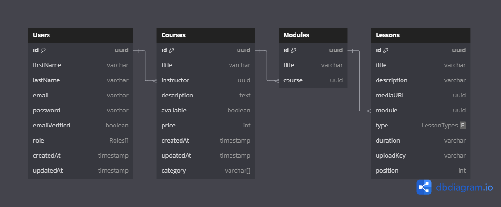

# E-LEARNING PLATFORM (LMS) <small>***_(In-progress)_***</small>
Welcome to the online learning management system designed to deliver educational content, track student progress, and manage course materials efficiently.

## Features
- **User Management:** Registration, Login, and role-based access (Instructors, and Admins)
- **Course Management:** Create, update and manage courses by instructors
- ***Adding more as the project progresses***

## Tech Stack
- **Language:** TypeScript
- **Framework:** NestJs
- **Database:** PostgresQL
- **API:** GraphQL
- **Authentication:** JWT
- **Documentation**: --

## Database Design 

## Prerequisites
- NodeJs(18+)
- PostgreSQL(14+)
- Altair (GraphQL API Testing)